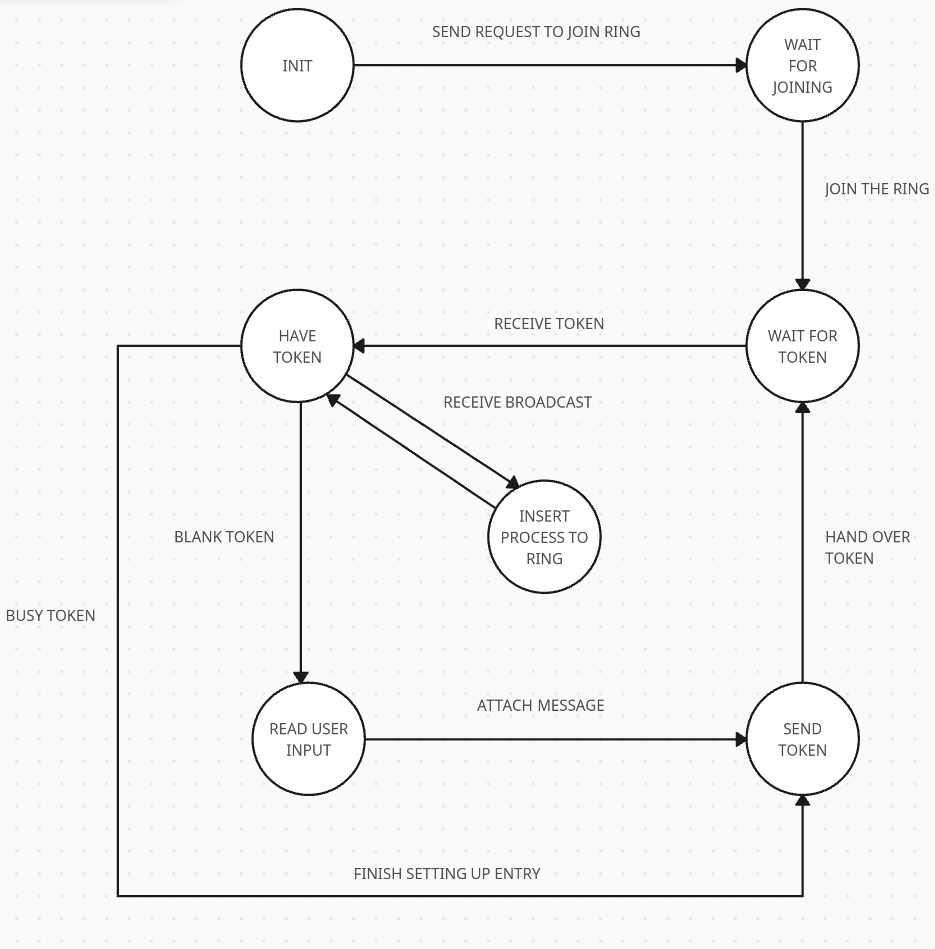

## Temat projektu

Program realizujący komunikację w logicznym pierścieniu (token ring) zbudowany w oparciu o protokół UDP.

## Treść

Napisać program realizujący komunikację w logicznym pierścieniu (token ring) w oparciu o protokół UDP.

### Założenia

- W komunikacji uczestniczą wezły / procesy (do testów minimum trzy, ale liczba może być zmienna); węzły identyfikowane są krótkimi nazwami ASCII. Należy mapować adresy IP wezłów na ich logiczne nazwy.
- Komunikacja następuje poprzez pakiet danych, tzw. „token” (znacznik), który jest stale przekazywany cyklicznie między procesami (rysunek 1). Jeśli proces A chce wysłać dane do procesu B, to czeka na otrzymanie pustego tokenu (tokenu bez danych), następnie „doczepia” do niego adres odbiorcy oraz dane przeznaczone do niego i wysyła token to swojego następnika w pierścieniu (rysunki 2, 3, 4, 5 pokazują przekazanie danych z B do D).
- W pierścieniu musi znajdować się zawsze jeden i tylko jeden znacznik.
- Ponieważ korzystamy z protokołu UDP, to w łączności węzeł–węzeł (przekazanie znacznika) powinien być użyty mechanizm gwarantujący niezawodność (może to być znany już protokół BAP lub inny podobny).
- Program powinien mieć charakter modularny. Sugerowane moduły:
  1. „niezawodny” transfer UDP (BAP),
  2. pierścień komunikacyjny (obsługa znacznika, adresacja, ruting, dane),
  3. transport arbitralnych danych w pierścieniu,
  4. testy i cmd-line.
- W testach można założyć, że przekazujemy dane tekstowe.
- Należy wprowadzić opóźnienie między odebraniem a odesłaniem tokenu, sensowna wartość to 1–5 s.
- Interfejs użytkownika – wystarczy prosty interfejs tekstowy. Wskazana jest zarówno realizacja pracy interaktywnej w trybie prostego cmd-line oraz testów realizowanych wsadowo (bez interwencji użytkownika).

### Warianty funkcjonalne

(Każdy zespół otrzyma jeden z wariantów W1 i W2.  
Wariant może modyfikować założenia podane wyżej, wtedy oczywiście ważniejsze są założenia z wariantu.)

- **W11** – Wprowadzić dodatkową funkcję dołączenia procesu do pierścienia. Powinno odbywa się to poprzez broadcast (rozgłaszanie). Węzeł (proces) zgłasza chęć akcesu do komunikacji, zostaje to potwierdzone i w efekcie zmodyfikowana zostaje lokalna tablica rutingu w określonych węzłach (rysunek 1). Realizacja przez dodatkowy „miniprotokół”, możliwych rozwiązań jest wiele, np. dołączenia może dokonać ten proces, który ma aktualnie znacznik. Uwaga – należy tak zaprojektować protokół, aby uniknąć wyścigów i innych niejednoznaczności.

### Warianty implementacyjne  

- **W22** – implementacja w C/C++  

## Interpretacja treści zadania

Celem projektu jest stworzenie aplikacji komunikującej się w logicznym pierścieniu za pomocą protokołu UDP. Aplikacja będzie obsługiwać przekazywanie tokena między procesami, umożliwiając im wysyłanie i odbieranie danych. Dodatkowo, aplikacja będzie implementować mechanizm dołączania nowych procesów do pierścienia za pomocą broadcastu, zapewniając aktualizację tablic routingu i unikając konfliktów.

Funkcje:

- Implementacja niezawodnego transferu UDP za pomocą protokołu BAP.
- Obsługa logiki pierścienia komunikacyjnego, w tym przekazywanie tokena i adresacja.
- Mechanizm dołączania nowych procesów do pierścienia poprzez broadcast.
- Prosty interfejs tekstowy do interakcji z użytkownikiem.

## Opis funkcjonalny (black-box)

System udostępnia następujące funkcje widoczne z zewnątrz:

1. **Uruchomienie węzła**  
   Użytkownik może uruchomić nowy węzeł, podając jego nazwę logiczną oraz podstawową konfigurację (np. port nasłuchu, adres broadcastu). Po uruchomieniu węzeł automatycznie próbuje dołączyć do istniejącego pierścienia albo utworzyć nowy.

2. **Przekazywanie tokena w pierścieniu**  
   Węzły przekazują między sobą token w ustalonej kolejności logicznego pierścienia. W danym momencie dokładnie jeden węzeł posiada token. Token krąży niezależnie od tego, czy aktualnie przesyłane są dane użytkownika.

3. **Wysyłanie wiadomości między węzłami**  
   Użytkownik może zlecić wysłanie wiadomości tekstowej z węzła A do węzła B. Węzeł A czeka na pusty token, dołącza do niego dane (nadawca, odbiorca, treść) i przekazuje token dalej. Węzeł docelowy odbiera dane, a następnie odsyła pusty token.

4. **Dynamiczne dołączanie nowych węzłów (wariant W11)**  
   Nowy węzeł może zgłosić chęć dołączenia poprzez komunikat broadcast. Jeden z istniejących węzłów koordynuje proces dołączenia, tak aby zaktualizować lokalne tablice routingu i wpiąć nowy węzeł w pierścień bez utraty lub duplikacji tokena.

5. **Niezawodny przesył między sąsiadami (BAP)**  
   Wszystkie przekazania tokena i danych między sąsiadującymi węzłami wykorzystują warstwę niezawodnego UDP (protokół BAP lub podobny), zapewniając wykrycie utraty pakietu i retransmisje.

6. **Interfejs użytkownika (CLI)**  
   Użytkownik ma do dyspozycji prosty interfejs tekstowy umożliwiający: uruchomienie węzła, obserwację logów, zlecanie wysyłania wiadomości do innych węzłów oraz (opcjonalnie) uruchamianie scenariuszy testowych w trybie wsadowym.

## Opis i analiza poprawności stosowanych protokołów komunikacyjnych

### Diagram stanu


### Idea na działanie protokołu dołączenia procesu do pieścienia

1. Proces chce dołączyć do pierścienia - wysyła broadcast. Wszystkie procesy w pierścieniu otrzymują broadcast - dodają go do swojej kolejki procesów oczekujących na dołączenie.
2. Proces posiadający token obsługuje dołączenie nowego procesu.
   - Jeśli proces jest już w trakcie wysyłania to ma zaciągnięty mutex. Kończy on wysyłanie, przekazuje token do następnego procesu w pierścieniu, stanie się on poprzednikiem procesu dołączającego.
   - Jeśli proces nie jest w trakcie wysyłania (is_sending == false) to obsługujemy dołączenie nowego procesu - wyciągamy proces z kolejki i odsyłamy broadcast typu accept podając tablicę routingu nowego procesu. Zainteresowane procesy aktualizują swoje tablice routingu. Wszystkie procesy wyrzucają ten proces z kolejki procesów oczekujących.
3. Nowy proces czeka na token i zaczyna normalną pracę

### Pseudokod obsługi dołączenia procesu do pieścienia

```c
int maxfd = max3(broadcast_socket, cli_socket, unicast_socket);
Queue = {}
bool is_sending = false;
while (1) {
    fd_set rfds;
    FD_ZERO(&rfds);

    FD_SET(broadcast_socket, &rfds);
    FD_SET(cli_socket, &rfds);
    FD_SET(unicast_socket, &rfds);

    int ret = select(maxfd + 1, &rfds, NULL, NULL, NULL); 
    if (ret < 0) {
        if (errno == EINTR) continue;  
        perror("select");
        break;
    }

    if (FD_ISSET(broadcast_socket, &rfds)) {
        handle_broadcast();
        continue;
    }

    if (Queue.not_empty() && has_token()) {
        lock(&mutex);
        if !is_sending {
            handle_join()
        }
        unlock(&mutex);
        continue;
    }

    if (FD_ISSET(cli_socket, &rfds) && has_empty_token()) {
        load_data_to_token();
    }

    if (FD_ISSET(unicast_socket, &rfds)) {
        is_sending = true;
        pthread_create(&handle_unicast);
    }
}

void handle_unicast() {
    lock(&mutex);
    pthread_cond_timedwait(timeout, mutex, timespec);
    is_sending = false;
    unlock(&mutex);
}
```

### Analiza poprawności protokołu dołączenia procesu do pierścienia
Proces A chce dołączyć do pierścienia. Wysyła broadcast, który jest odbierany przez wszystkie procesy w pierścieniu.Proces posiadający token np. proces B sprawdza czy jest w trakcie wysyłania tokena.
- Scenariusz 1: Jeśli tak, to kończy wysyłanie i przekazuje token dalej. Wysyłanie przebiegnie poprawnie ponieważ znajduje się w strefie krytycznej i nie może zostać przerwane poprzez pojawienie się broadcastu. Mutex zostanie przez nią zaciągnięty po obudzeniu ze zmiennej warunkowej. Obsługą dołączenia procesu A zajmie się proces będacy następnikiem B. Reszta jak w scenariuszu 2. 

   $\rightarrow$ Przykładowy pierścień na początku: **B[token]** -> C -> D -> B. 

   $\rightarrow$ Po dołączeniu A: B -> A -> **C[token]**-> D -> B
- Scenariusz 2: Proces B posiadający token nie jest w trakcie wysyłania tokena. Odbiera broadcast od procesu A i obsługuje jego dołączenie. Wysyła broadcast typu accept do wszystkich procesów w pierścieniu z tablicą routingu procesu A. Wysyłanie broadcastu nie nastąpi równolegle z przesłaniem tokenu, ponieważ obie operacje są w strefie krytycznej i wzajemnie się wykluczają. Zainteresowane procesy aktualizują swoje tablice routingu i wyrzucają proces A z kolejki procesów oczekujących na dołączenie. Proces B staje się następnikiem procesu A w pierścieniu. 

   $\rightarrow$ Przykładowy pierścień na początku: **B[token]** -> C -> D -> B. 

   $\rightarrow$ Po dołączeniu A: A -> **B[token]** -> C-> D -> A

### Opis struktur danych protokołu dołączenia procesu do pieścienia

- Struktura Token:

```c
typedef struct {
    char sender[32];        
    char receiver[32];      
    char data[256];        
    uint8_t is_empty;      
} Token;
```

- Struktura Routing Table Entry:

```c
typedef struct {
    char node_name[32];        
    unsigned short port;   
    unsigned int version;
    Entry* successor;
    Entry* predecessor;     
} Entry;
```
- Enum Type Message:
```c
typedef enum {
    JOIN_REQUEST,
    JOIN_ACCEPT
} MessageType;
```

- Struktura Broadcast Message:

```c
typedef struct {
    MessageType type;      
    char node_name[32]; 
    unsigned short port; 
} BroadcastMessage;
```

### Opis poprawności działania protokołu BAP
Do transmisji unicast zostanie użyty standardowy protokół BAP. 

Proces obsługujący dołączanie nowego procesu do pierścienia będzie oczekiwał na potwierdzenie od 2 procesów odbioru broadcastu typu ACCEPT (od jego poprzednika i procesu, który chce dołączyć do pierścienia) np. poprzez broadcast typu ACK. W przypadku braku potwierdzenia w określonym czasie proces wysyłający accept będzie ponawiał wysyłanie komunikatu broadcast. Procesy odbierające komunikat broadcast będą wysyłały potwierdzenie odbioru do nadawcy. W ten sposób zostanie zapewniona niezawodność transmisji broadcast.

W przypadku transmisji broadcast typu JOIN_REQUEST nie będzie wymagane potwierdzenie odbioru, ponieważ proces będzie wysyłał co jakiś czas nowe żądanie dołączenie. 
Jeśli w ustalonym czasie nie dostanie ACCEPT to po prostu wyśle ponownie JOIN_REQUEST.

Proces przy wysyłaniu broadcastu JOIN_REQUEST będzie generował identyfikator żądania dołączenia (np. losowa liczba). Procesy odbierające broadcast będą przechowywały identyfikatory już obsłużonych żądań dołączenia, aby uniknąć wielokrotnej obsługi tego samego żądania.

Wersjonowanie - razem z tokenem będzie przesyłana aktualna wersja pierścienia - liczba całkowita zwiększana o 1 przy każdej zmianie w pierścieniu (dołączenie nowego procesu). Procesy przy odbiorze tokena będą porównywały wersję pierścienia w tokenie z lokalną wersją. Jeśli wersja w tokenie będzie nowsza to proces usunie odpowiednią liczbę requestów z kolejki oczekujących do dołączenia (różnica wersji = liczba dołączonych procesów od ostatniego przejścia tokena przez dany proces).

## Planowany podział na moduły i struktura komunikacji

1. **Moduł `reliable_udp` (BAP)** 
   - Wewnątrz modułu znajduje się resolver do mapowania nazw węzłów na adresy IP i porty UDP.
   - Odpowiada za niezawodny transfer między dwoma endpointami UDP.  
   - Udostępnia API w stylu: `rudp_send()`, `rudp_recv()`, które wewnętrznie realizują potwierdzenia, numery sekwencyjne, timeouty i retransmisje.

2. **Moduł `ring_core` (logika token ring)**  
   - Zawiera reprezentację tokena (struktura C) oraz tablicę routingu (mapowanie nazwa węzła → adres/port + następnik).  
   - Implementuje logikę przekazywania tokena, obsługę pustego tokena, osadzanie/odbiór danych użytkownika.

3. **Moduł `join_protocol` (wariant W11)**  
   - Obsługuje komunikaty broadcast związane z dołączaniem nowych węzłów.  
   - Utrzymuje synchronizację z modułem `ring_core`, tak aby nie doszło do wyścigów.

4. **Moduł `cli` / `node_app` (interfejs procesu-węzła)**  
   - Parsuje argumenty linii poleceń (np. `--name`, `--listen-port`, `--broadcast-addr`).  
   - Aplikacja nasłuchuje na 3 gniazdach: broadcast, unicast, CLI (interfejs użytkownika).  
   - CLI udostępnia użytkownikowi prosty interfejs tekstowy (np: `send <node> <msg>`).

5. **Moduł `tests`**  
   - Zawiera scenariusze testowe (np. skrypty uruchamiające kilka węzłów w Docker Compose).  
   - Odpowiada za generowanie logów wykorzystywanych potem w sprawozdaniu.

## Zarys koncepcji implementacji

- Język programowania: C
- Biblioteki: pthread, socket, arpa/inet, podstawowe biblioteki do pracy z językiem C np. stdio.h, stdlib.h, string.h, time.h
- Narzędzia: CMake, Docker Compose, Docker

Projekt zostanie przetestowany na serwerze Bigubu.

